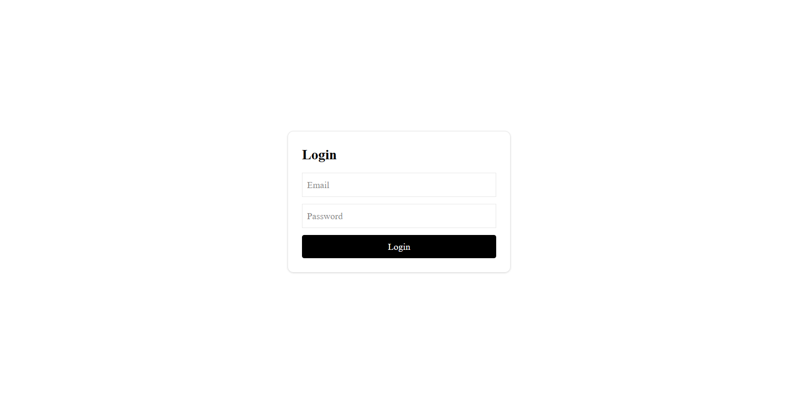
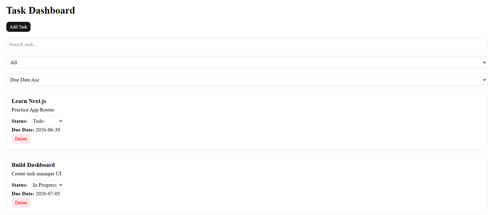
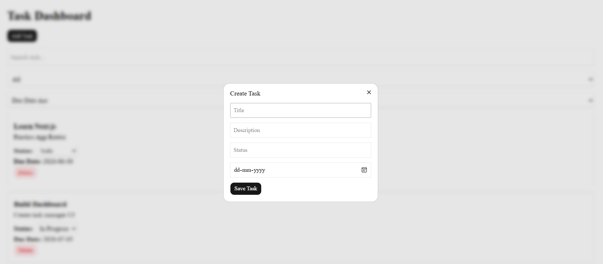
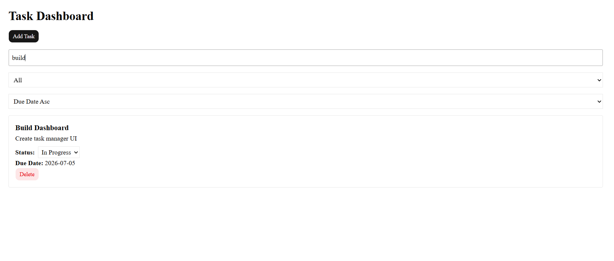
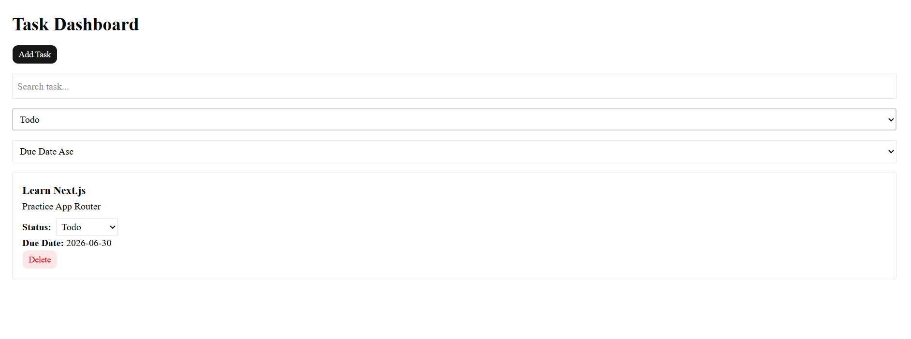

## Task Management Dashboard

A modern Task Management Dashboard built using Next.js, TypeScript, Tailwind CSS, and shadcn/ui. The application allows users to manage daily tasks efficiently with task creation, status updates, searching, filtering, and sorting functionalities.

## Features

* Login Page with localStorage Authentication
* Create New Tasks
* Delete Tasks
* Dynamic Status Management
* Real-time Search Functionality
* Filter Tasks by Status
* Ascending & Descending Due Date Sorting
* Responsive User Interface

## Tech Stack

* Next.js
* TypeScript
* React
* Tailwind CSS
* shadcn/ui
* React Hooks

## Installation

bash
git clone https://github.com/fathimadhina/task-dashboard.git

cd task-dashboard

npm install

npm run dev

## Project Structure

text
app/
├── dashboard/
├── login/
├── page.tsx

components/
├── ui/

data/
├── tasks.ts

lib/
├── utils.ts

public/

## Functionalities

### Authentication

* Mock login system using localStorage.
* Redirects authenticated users to the dashboard.

### Task Management

* Add new tasks.
* Delete existing tasks.
* Update task status dynamically.

### Search & Filter

* Search tasks by title.
* Filter tasks by status (Todo, In Progress, Completed).

### Sorting

* Sort tasks by due date in ascending order.
* Sort tasks by due date in descending order.

## Screenshot

Add your project screenshot here after uploading it to the repository.

### Login Page

### Dashboard

### Add Task

### Search Functionality

### Task Filter

## Future Improvements

* Edit Existing Tasks
* Dark Mode Support
* Backend API Integration
* Database Connectivity
* User Authentication with JWT

## Developer

Fathima P

MERN Stack Developer Trainee

GitHub: https://github.com/fathimadhina
